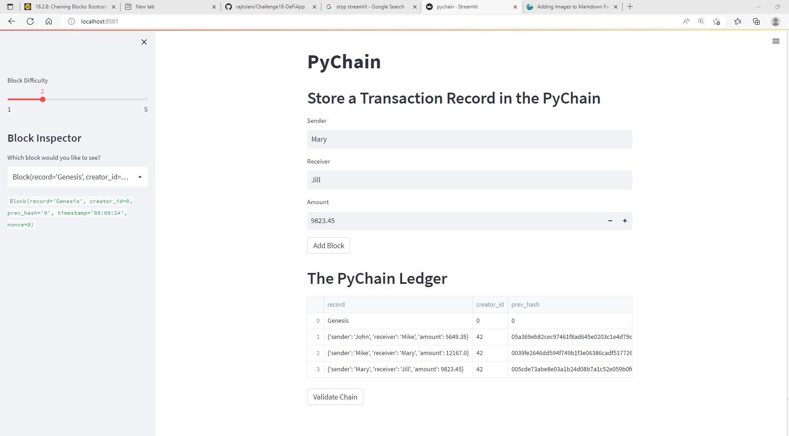
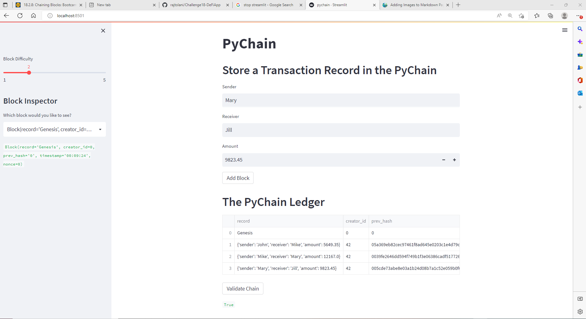

# Challenge18-DeFiApp

## DeFi app. Allows for Simple bank transfer between 2 parties. The trasactions are stored in a simple block chain Datastructure

## The "Sender" "Reciever" and "Amount" are stored in instances of class Record

## A new block is created for each transfer. THe information stored in the block is  
    Record: Sender, receiver, amount
    Creator_id : ID of transaction creator
    timestamp : Date/Time of transaction
    nonce : additional data used to meet the requirement for the hash key

## sha256 is used to create a hash for the block. The nonce value is changed till the hash value meets the requirement (hash starting with "0000" for difficulty 4), FUnction proof of work itterates through increasing values on integer nonce till has meets the requirement

## THe blocks are chained and the validty checks to ensure the has for previous block is equal (same) as the previous has stored in the block

## Nice challenge. Wish the started code did less. Very little had to be added to started code to finish this assignment

## Screenshot of Streamlit showing transaction

## Screenshot of Streamlit App showing results of Block Chain Validity Test

